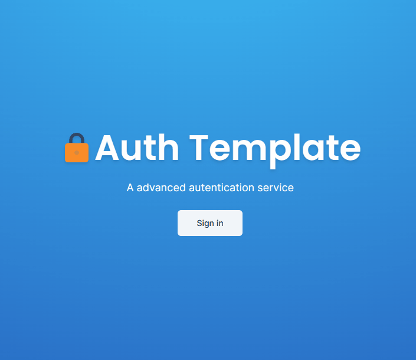

# Next Auth v5 Template



This is a repository for Next Auth v5

Key Features:
- Next-auth v5 (Auth.js)
- Next.js 14 with server actions
- Credentials Provider
- OAuth Provider (Social login with Google & GitHub)
- Forgot password functionality
- Email verification
- Two factor verification
- User roles (Admin & User)
- Login component (Opens in redirect or modal)
- Register component
- Forgot password component
- Verification component
- Error component
- Login button
- Logout button
- Role Gate
- Exploring next.js middleware
- Extending & Exploring next-auth session
- Exploring next-auth callbacks
- useCurrentUser hook
- useRole hook
- currentUser utility
- currentRole utility
- Example with server component
- Example with client component
- Render content for admins using RoleGate component
- Protect API Routes for admins only
- Protect Server Actions for admins only
- Change email with new verification in Settings page
- Change password with old password confirmation in Settings page
- Enable/disable two-factor auth in Settings page
- Change user role in Settings page (for development purposes only)

### Prerequisites

**Node version 18.7.x**

### Cloning the repository

```shell
git clone https://github.com/GleristonCastro/nextauth-template.git
```

### Install packages

```shell
npm i
```

### Setup .env file


```js
DATABASE_URL=
DIRECT_URL=

AUTH_SECRET=

GITHUB_CLIENT_ID=
GITHUB_CLIENT_SECRET=

GOOGLE_CLIENT_ID=
GOOGLE_CLIENT_SECRET=

RESEND_API_KEY=

NEXT_PUBLIC_APP_URL=
```

### Setup Prisma
```shell
npx prisma generate
npx prisma db push
```

Note: The database used was PostgreSQL. To create the system, a Docker image was used. You can consult the official documentation by [clicking here](https://www.docker.com/blog/how-to-use-the-postgres-docker-official-image/).

### Start the app

```shell
npm run dev
```

## Available commands

Running commands with npm `npm run [command]`

| command         | description                              |
| :-------------- | :--------------------------------------- |
| `dev`           | Starts a development instance of the app |